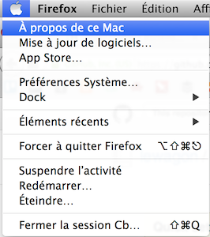
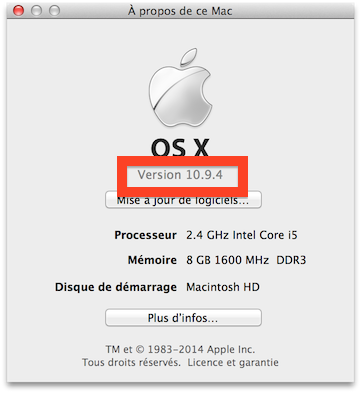

# Installation de Jekyll sur Mac OS X

L'installation de Jekyll se fait en plusieurs étapes. Merci de les
suivres scrupuleusement dans l'ordre.

## Mise à jour de Mac OS X

Vérifiez votre version de Mac. Cliquez su la pomme en haut à gauche de l'écran,
puis sélectionnez "À propos de ce Mac". Vous devrier voir apparaître une fenêtre
d'information. Ce qui nous intéresse, c'est la version de Mac.

