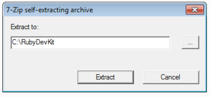
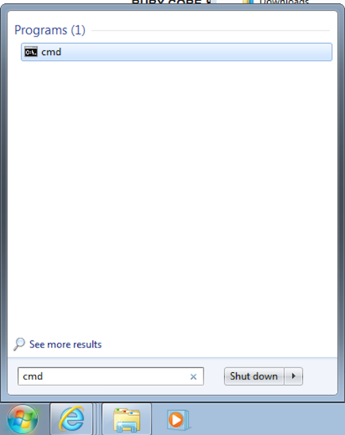

# Installation de Jekyll sur Windows

## Ruby

Téléchargez et installez Ruby. Si vous ne savez pas quelle version choisir
ci-dessous, la première ira très bien :

- [Ruby 2.0.0](http://dl.bintray.com/oneclick/rubyinstaller/rubyinstaller-2.0.0-p481.exe?direct)
- [Ruby 2.0.0 x64](http://dl.bintray.com/oneclick/rubyinstaller/rubyinstaller-2.0.0-p481-x64.exe?direct)

Une fois téléchargez, double cliquez sur l'installeur. Attention au moment de l'installation,
sur l'écran ci-dessous cochez la case du milieu:


## Devkit

Vous avez besoin d'installer un compilateur pour faire marcher Jekyll. Ne vous inquiétez pas,
suivez la procédure suivante. Téléchargez l'un des installateurs ci-dessous :

- [Devkit](http://cdn.rubyinstaller.org/archives/devkits/DevKit-mingw64-32-4.7.2-20130224-1151-sfx.exe)
- [Devkit x64](http://cdn.rubyinstaller.org/archives/devkits/DevKit-mingw64-64-4.7.2-20130224-1432-sfx.exe)

Une fois téléchargé, double cliquez sur l'installateur. La fenêtre suivante va s'ouvrir :



Changez la destination d'extraction pré-remplie par `C:\RubyDevKit` et cliquez sur le bouton "Extract".

Maintenant, nous allons écrire des lignes de commande dans le terminal. Pour lancer le terminal, cliquez sur le bouton Démarrer en bas à gauche de Windows, et tapez `cmd`. Vous devriez voir apparaître le programme à lancer :



Alternativement vous pouvez également lancer "Windows PowerShell".

Une fois votre terminal lancé, vous pouvez commencer à taper des commandes. Commençons par
celle ci-dessous. Une fois la commande tapée, appuyez sur Entrée.

```bash
cd C:\RubyDevKit
```

Maintenant, tapez et executez la commande suivante :

```bash
ruby dk.rb init
```

et enfin :

```bash
ruby dk.rb install
```

Et voilà !

## Jekyll

Maintenant vous pouvez rester dans le terminal et taper :

```bash
gem install github-pages
```

qui va vous installer Jekyll et toutes les dépendances utiles pour l'hébergement sur GitHub Pages.

